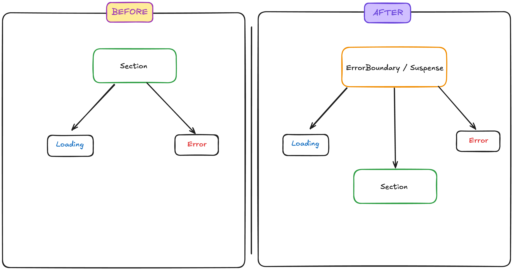

```ts
export default function Section() {
  ...
  const {
    items: cartItems,
    initialLoadStatus,
    removeItem,
    updateItem,
  } = useCartItems();

  const {
    selectedItemId,
    initSelectedItemId,
    onChangeSelected,
    onChangeAllSelected,
  } = useCartItemSelected(storage);

  const { networkError, error, handleError, clearError } = useError();
  ...

  return (
    <SectionLayout>
      {initialLoadStatus === "loading" && <Loading />}
      {initialLoadStatus === "success" && (
        <>
          <Header>
            <Title>장바구니</Title>
            {cartItems.length > 0 && (
              <SubText>
                현재 {cartItems.length}종류의 상품이 담겨있습니다.
              </SubText>
            )}
          </Header>
          {cartItems.length ? (
            <>
              <Checkbox
                checked={cart.isItemAllSelected()}
                labelText={"전체선택"}
                onChange={() =>
                  onChangeAllSelected(cartItems.map((item) => item.product_id))
                }
              ></Checkbox>
              <CartItemList
                cartItems={cartItems}
                onUpdateQuantity={onUpdateQuantity}
                onDeleteItem={onDeleteItem}
                onChangeSelected={onChangeSelected}
                selectedItemId={selectedItemId}
              />
              <SubText className="icon-text">
                <Info aria-label="정보" />총 주문 금액이 100,000원 이상일 경우
                무료 배송됩니다.
              </SubText>
              <PriceSummary
                rows={[
                  { label: "주문 금액", value: priceSummary.price },
                  { label: "배송비", value: priceSummary.delivery },
                ]}
                total={{
                  label: "총 결제 금액",
                  value: priceSummary.totalPrice,
                }}
              />
            </>
          ) : (
            <EmptyCart>
              <p>장바구니에 담은 상품이 없습니다.</p>
            </EmptyCart>
          )}
          <FixedButton
            disabled={!cart.selectedItemCount()}
            onClick={goToOrderCheckPage}
          >
            주문 확인
          </FixedButton>
        </>
      )}
      {initialLoadStatus === "error"  && <Error />}
    </SectionLayout>
  );
}
```

실제 나의 장바구니 코드다.

해당 컴포넌트는 장바구니페이지에서 섹션부분을 렌더링하는(보여주는) 역할을 하며 각 섹션내 컴포넌트와 데이터를 조율하는 역할을 한다.

현재 컴포넌트는 조건 분기를 통해 세가지 케이스에 대응하는 컴포넌트를 렌더링한다.

1. 로딩중일때
2. 성공일때
3. 에러가 발생했일때

장바구니 섹션 컴포넌트는 **“장바구니페이지 섹션을 보여준다”** 라는 본질적 책임외에 로딩중일때, 성공일때, 에러가 발생했을때 .. 각 세가지 상황에 어떻게 보여줄지에 대해서도 알고있다.

이 컴포넌트는 객체지향적인 관점에서 옳지않다.

### 왜?

1. `Section` 컴포넌트는 너무 많은 책임을 지고 있다. 그리고(draw) + 조율하며 + 에러(Fetch 상태)를 소유한다.

2. `Section` 컴포넌트는 상태에 따른 컴포넌트에 강하게 결합되어 있다. 본인이 API Fecth 상태를 알고 그것에 스스로 결정하고 대응한다. 이후에 다른 에러 컴포넌트로 전부 전환한다고 했을때 나는 **“장바구니페이지 섹션을 보여주는”** 컴포넌트를 열고 수정해야할것이다.

`Suspense`와 `ErrorBoundary`를 사용한 버전으로 전환하면 어떨까?

```ts
export default function CartPage() {
  return (
      <ErrorBoundary fallback={<NetworkError />}>
        <Suspense fallback={<Loading />}>
          <Section />
        </Suspense>
      </ErrorBoundary>
  );
}
```

에러가 발생했을때 그리고 Fetch 상태가 pending중일때 보여질 UI가 분리됐다.

이제 `Section` 컴포넌트는 이전과 달리 API Fetch 상태를 알필요가 없기 때문에 상태에 따라 보여질 컴포넌트를 스스로 결정하지 않을것이다.

```ts
function Section() {
	// 예시
  const cartItems = use(cartResource);

  return (
    <>
      <Header>
        <Title>장바구니</Title>
        {cartItems.length > 0 && (
          <SubText>현재 {cartItems.length}종류의 상품이 담겨있습니다.</SubText>
        )}
      </Header>

      {cartItems.length ? (
        <>
          <Checkbox
          checked={cart.isItemAllSelected()}
          labelText="전체선택"
          onChange={() => onChangeAllSelected(cartItems.map((i) => i.product_id))}
          />
          <CartItemList
          cartItems={cartItems}
          onUpdateQuantity={onUpdateQuantity}
          onDeleteItem={onDeleteItem}
          onChangeSelected={onChangeSelected}
          selectedItemId={selectedItemId} />
          <SubText className="icon-text">
            <Info aria-label="정보" />총 주문 금액이 100,000원 이상일 경우 무료 배송됩니다.
          </SubText>
          <PriceSummary rows={[...]} total={{...}} />
        </>
      ) : (
        <EmptyCart><p>장바구니에 담은 상품이 없습니다.</p></EmptyCart>
      )}

      <FixedButton disabled={!cart.selectedItemCount()} onClick={goToOrderCheckPage}>
        주문 확인
      </FixedButton>
    </>
  );
```

Section에서 분기처리가 사라졌다.

이제는 상태를 알 필요도 없고 상태에 따라 어떤 컴포넌트를 보여주지 않아도 된다.

에러가 발생했을때 Throw된 에러는 상위 컴포넌트에 전파돼 `ErrorBoundary`가 처리할 것이다.

Pending또한 `use`를 통해 API 요청시 Promise가 Throw 되어 `Suspense`의 fallback 이 트리거 될것이다.

그리고 그 결과에 따라 성공 컴포넌트인 `Section`이 렌더링되거나 실패 컴포넌트인 Error가 렌더링 될것이다.

> 핵심은 … 이제 Section은 **“성공했을때 뭘 그리나요” 즉, “장바구니 페이지 섹션을 보여준다” 라는 책임**만 진다.

컴포넌트가 아닌 코드로 표현하면 다음과 같이 변경되었다.

```ts
## Before

class Section {
  void render(Status status) {
    if (status == Status.LOADING) { renderLoading(); }
    else if (status == Status.SUCCESS) { renderSuccess(); }
    else if (status == Status.ERROR) { renderError(); }
  }
}

## After

interface RenderStrategy {
  render(): void;
}

class LoadingView implements RenderStrategy {
  render() { console.log("로딩 스피너 표시"); }
}

class ErrorView implements RenderStrategy {
  render() { console.log("네트워크 에러 화면 표시"); }
}

class Section implements RenderStrategy {
  // 성공상태만 그린다.
  render() { console.log("장바구니 목록 표시"); }
}

// 조립(DI)
class CartBoundary {
  constructor(
    private readonly loading: RenderStrategy,
    private readonly content: RenderStrategy,
    private readonly error: RenderStrategy
  ) {}

  render(status: "loading" | "success" | "error") {
    const strategy = { loading: this.loading, success: this.content, error: this.error }[status];
    strategy.render();
  }
}

const boundary = new CartBoundary(
  new LoadingView(),
  new CartSection(),
  new NetworkErrorView()
);
```

여기서 눈치챌 수 있는 부분은 원래 `Section`은 `render`상태에 따라 보여지는 컴포넌트에 의존했다.

하지만 이후코드는 `CartBoundary`에 각 보여질 컴포넌트를 의존성 주입한 형태다.

컴포넌트를 기준으로 의존성 관계를 표현하면 다음과 같다.



이후 관계를 보면 `Section`은 Loading, Error에 대해 전혀 모른다.

그냥 `Section`의 목적인 **“장바구니페이지 섹션을 보여준다”**에만 집중한다.

`Section`내부에서 Promise가 Throw됐을때 `Section`은 아무런 행동을 하지 않는다.(어떤일이 벌어질지에 대해서도 모른다)

Throw되고 그 Throw를 통해 다른 행동을 취하는건 `Suspense/ErrorBoundary`의 동작이다.

`Section`은 아무것도 모른다. 그냥 실패하면 Throw할게 라는 신호만 보낸다.

이후 처리는 `Suspense`, `ErrorBoundary`가 처리한다.

객체지향적으로 "Throw라는 메시지를 전송할게~"가 된다.

그리고 그 메시지를 해석하고 처리하여 응답하는 건 `Suspense`와 `ErrorBoundary`가 맡는다.

여기서 핵심은 의존성이 역전되었다는것이다.

이전코드는 `Section`이 Loading, Error를 렌더링하기 위한 방식을 알아야했다.(`initialLoadStatus === "loading"` …)

하지만 지금은 `Section`이 실패하거나 대기상태이면 그냥 throw할게라고 정하고 그 외 동작은 `Suspense`와 `ErrorBoundary`가 그 정함에 따라 맞춰 움직인다.(메시지 관점을 생각하면 이해하기 쉽다.. 메시지를 이해하고 해석하여 판단하는건 `Suspense`와 `ErrorBoundary`)

의존성 역전 원칙의 핵심인 “인터페이스를 누가 소유하냐가 Section이 되었다”

즉, DIP가 적용된 사례라고 볼 수 있다.

이렇게 `Suspense`, `ErrorBoundary`를 통해 객체지향 관점에서 DIP, DI를 컴포넌트에도 적용할 수 있었다.
