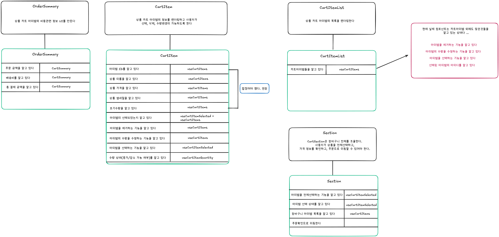

## 협력

다양한 객체들이 특정한 기능을 구현하기 위해 메시지를 주고받으면서 상호작용한다는 것..

이처럼 객체들이 애플리케이션의 기능을 구현하기 위해 수행하는 상호작용을 ‘**협력’**이라고 한다.

<aside>
💡

**자율적인 객체란 ?**

자신의 상태를 직접 관리하고 스스로의 결정에 따라 행동하는 객체

→ **결합도가 높다 !**

자율적인 객체의 특성을 잃게 된다. 결합이 존재할때 보통 외부에서 직접적인 접근이 가능하다는 뜻(외부에서 해당 객체의 내부 상태를 직접 보고 조작이 가능하다.)이다. 이건 결국 자율적인 객체의 특성을 잃게 만드는 부분이다.

</aside>

> **협력이라는 문맥을 고려하지 않고 특정 객체의 행동을 결정하는 것은 아무런 의미가 없다.**

책에서 나온 예제처럼 영화 예매를 위한 협력에서 Movie는 요금을 계산하는 역할을 맡았다.

만약 “영화 예매”라는 중요한 목적이 빠진 상태로 Movie객체를 구현했다면 Movie에 play, screen 과 같은 동작이 추가되었을거 같다.

## 책임

객체에 의해 정의되는 응집도 있는 행위의 집합, 객체가 유지해야 하는 정보와 수행할 수 있는 행동에 대해 계략적으로 서술한 문장.

객체의 책임

- 무엇을 알고 있는가 ?(상태)
- 무엇을 할 수 있는가 ?(행동)

> **적절한 협력이 적절한 책임을 제공하고, 적절한 책임을 적절한 객체에게 할당해야만 단순하고 유연한 설계를 창조할 수 있다.**

→ **‘적절’**… 마법의 단어다.. 이 적절함은 어떻게 찾아 나가야할까?

협력을 설계하는 출발점

→ 시스템이 사용자에게 제공하는 기능을 시스템이 담당할 하나의 책임으로 바라보는 것.

<영화예매 예시..>

→ 영화를 예매한다. , 가격을 측정한다. , 할인금액을 측정한다. … 이런식 ?

메시지를 만들고 메시지를 처리할 적절한 객체를 선택하라. (정보를 가장 많이 알고 있는 객체가 대상이다, 무조건적인건 아니다.. 응집/결합 관점에서 차이가 발생할 수도)

### 메시지가 객체를 결정한다

보통은 객체를 먼저 생각하기 마련이다.

그리고 객체에 책임을 부여한다.

하지만 객체에게 책임을 할당하는 데 필요한 메시지를 먼저 식별하고 메시지를 처리할 객체를 나중에 선택하는게 중요하다.

즉, 객체 → 메시지가 아닌 메시지 → 객체

<aside>
💡

**객체가 충분히 추상적이면서 미니멀리즘을 따르는 인터페이스를 가지게 하고 싶다면 메시지가 객체를 선택하게 하라**

</aside>

### 행동이 상태를 결정한다.

초보자들은 먼저 객체에 필요한 상태가 무엇인지를 결정하고, 그 후에 상태에 필요한 행동을 결정한다.

→ 정확히 나다

자연스럽게 상태에 의존한 메서드가 만들어지게 된다. → 객체의 내부 구현이 객체의 퍼블릭 인터페이스에 노출되도록 만들기 때문에 캡슐화를 저해한다.

<aside>
💡

**항상 협력이라는 문맥 안에서 객체를 생각하라**

</aside>

## 역할

객체가 어떤 특정한 협력 안에서 수행하는 책임의 집합을 **역할**이라고 부른다.

메시지 → 익명의 역할 → 역할을 수행할 객체 찾기

**문제를 해결하기 위해서는 객체가 아닌 책임에 초점을 맞춰라**

→ AmountDiscoutPolicy, PercentDIscountPolicy 모두 할인 요금 계산이라는 동일한 책임을 수행한다.

그렇기에 “할인 요금을 계산하라”라는 메시지에 응답할 수 있는 대표자(인터페이스)를 생각하면 두 협력을 하나로 통합할 수 있다.

인터페이스를 따르는 두 객체를 정의하고 실제로 런타임에 어떤 객체가 사용될지 결정된다.

즉, 교대로 바꿔 끼울 수 있는 하나의 슬롯이 생긴것과 같다.

이 슬롯이 바로 **역할**

<aside>
💡

**역할은 다른 것으로 교체할 수 있는 책임의 집합**

</aside>

### 역할 어떻게 판단할까 ?

꼭 처음부터 역할로 둘 필요 없다.

천천히 관찰하면서 역할로 만들어나가도 좋다.

<aside>
💡

**다양한 객체들이 협력에 참여한다는 것이 확실하다면 역할로 시작하라**. **하지만 모든 것이 안개 속에 둘러싸여 있고 정확한 결정을 내리기 어려운 상황이라면 구체적인 객체로 시작하라**

</aside>

### 나의 CRC

### 추상화

‘추상화’ 라는 의미에 집중했을때 어떤 것이 떠오를까 ?

나는 ‘흐릿하게 보이는 무언가’가 보인다.

정확한 형상은 보이지 않지만 ‘흐릿하다’

명확하지 않다.

‘대충 어떤 것이 보여요..’ 라고 답하는거 같다.

코드에서 우리가 흔히 말하는 ‘추상화’또한 같은게 아닐까 ?

명확하지 않다.

하지만 대충 우리는 ‘어떠 어떠한 것이 있을거 같아요’라는걸 말한다.

그 데이터에는 이런게 있고… 이런게 있을거 같은데요 ?

또는 ‘이러이러한 책임을 가지고 이러한 동작을 할거 같은데요?’ 와 같이 말이다.

이번에는 커피숍을 상상해보자.

카운터 뒤에 선 사람이 보인다. 우리는 그를 '바리스타'라고 부른다. (알바생일수도)

그런데 그 사람의 일정이 끝나고 다른 커피숍을 갔을때, 이제 그는 '손님'이다.

같은 사람인데 역할이 바뀌었다.

바리스타라는 역할 안에는 그 사람의 나이도, 얼굴도, 어제 무엇을 했는지도 없다.

전부 지워졌다. 남은 것은 '주문을 받고 커피를 내린다' 뿐이다.

지웠기 때문에 오늘은 또 다른 누군가가 그 자리에 설 수 있다.

추상화란 뭘까 ?

‘흐릿하게 보이는 무언가’에서 이 ‘흐릿함’은 의도된거 였다.

그 ‘흐릿함’속에서 우리는 ‘책임’, ‘역할’을 유추할 수 있고 눈을 제대로 뜨기 전까지 누구인지 정확히 모른다.

“-안톨리니-”
