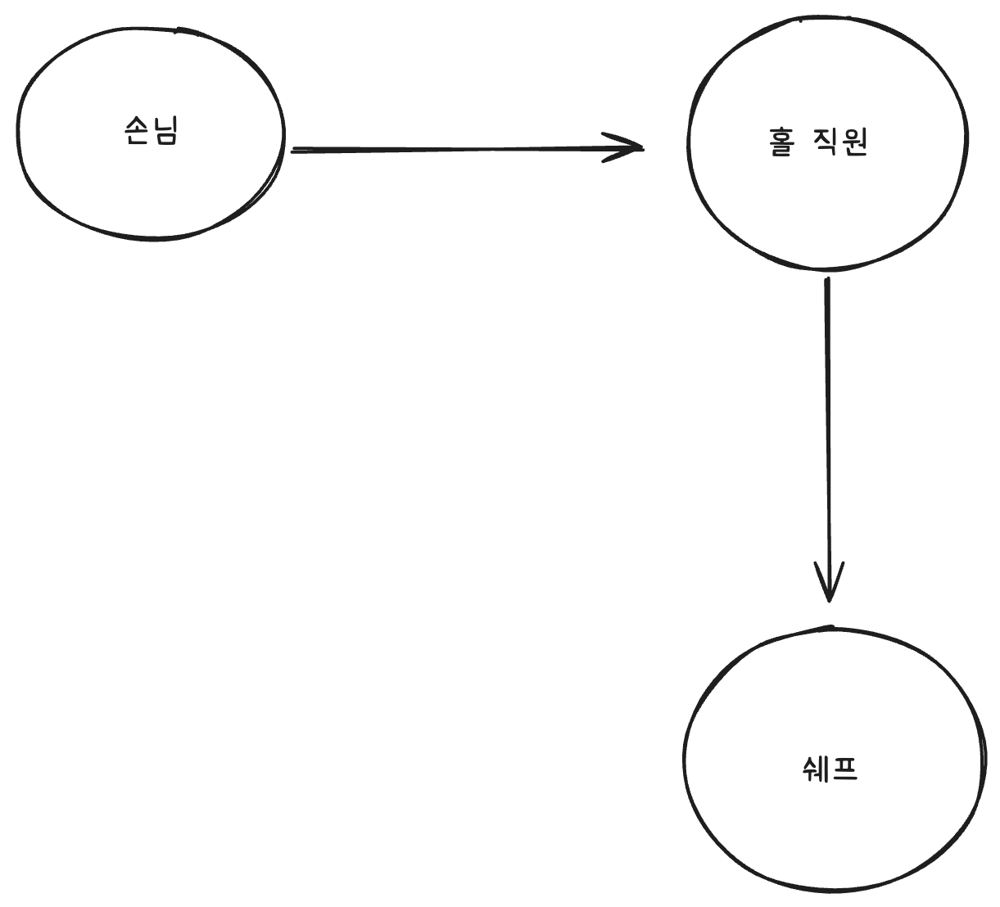
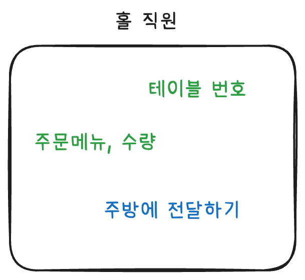
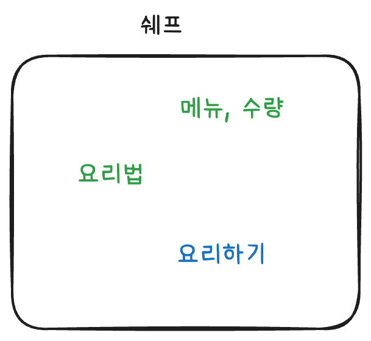

# 그래서 ? 왜 ? 객체지향 ?

## 객체지향, 이거 왜 알아야 합니까 ?

우리는 좋은 코드를 작성하려고 한다.

어쩌면 객체지향을 학습하는것도 좋은 코드를 위함이기도 하다.

**“그래서 ? 좋은 코드란 뭘까 ?”**

사실 나도 잘 모른다.

솔직히 말하면 **“좋은 코드”** 는 상황마다 너무 다르고 풀려고 하는 문제마다 또 다를 수 있다.

그래도 일반적인 경우를 생각하면 **“좋은 코드”** 가 통용적으로 적용되는 장점 몇가지가 있다.

- 응집은 높고 결합은 낮은 변화에 대응하기 좋은 코드.
- 관심사에 맞게 맥락이 분리되어 흐름을 읽어가기 쉬운 가독성이 좋은 코드.
- 인터페이스만 보고도 읽는이가 동작을 이해하고 결과를 예측할 수 있는 코드.
- 책임과 의존관계가 명확하여 테스트 하기 좋은 코드.

이 네 가지 중에 **“객체지향”** 의 원칙이 가장 잘 적용되는 부분은 어디일까 ?

아마도 나는 **“변화에 대응하기 좋은 코드”** 인거 같다.

재밌는 사실이 있다.

**“변화에 대응하기 좋은 코드”** 는 책임과 의존관계가 명확해야 한다.

그렇기에 자연스럽게 **“테스트하기 좋은 코드”** 가 될 수 있다.

또 **“책임과 의존관계가 명확한 코드”** 는 **“관심사에 맞게 맥락이 분리”** 되어야 한다.

그렇기에 **“가독성이 좋은 코드”** 가 될 수 있다.

**“관심사에 맞게 맥락이 분리”** 되어 있는 코드는 **“좋은 이름”** 을 비교적 가지기 쉽고 **“책임과 의존관계가 명확”** 하기 때문에 더욱 더 **“인터페이스만 보고도 결과를 예측할 수 있는 코드”** 가 될 수 있다.

이 네 원칙은 달라보이지만 동떨어져 있지 않다.

적절하게 나눈 책임과 의존 관계는 변경의 영향을 줄인다.

그렇게 하나의 책임을 가진 객체는 코드를 이해하고 검증하는 데에도 도움을 준다.

객체지향은 객체에 책임을 배분하고 객체 사이의 협력을 설계하면서 이런 특성을 추구한다.

## 상상속 객체지향

**객체지향은 왜 응집도가 높고 결합도가 낮은걸까 ?**

하나의 비지니스를 목표로 할때 객체지향은 그 비지니스를 완성하기 위한 하나의 큰 책임을 여러개로 세분화한다.

그리고 그 세분화한 객체들은 **“메시지”** 를 통해 **“소통”** 한다.

이 **“소통”** 은 우리가 바라보는 **“협력”** 이 된다.

즉, **여러가지 세분화한 “책임”들이 서로 “협력” 하여 하나의 “비즈니스”를 완성해 간다.**

여기서 말하는 **“책임”** 은 강력하다.

우리는 그들을 **“전문가”** 로 바라보기 때문이다.

잘 나가는 레스토랑 금토동 판교 제2 테크노밸리 **“화란”** 을 생각해보자.

나는 언제나 그랬듯이 XO 게살볶음밥을 주문한다.

이 주문이 들어갔을때 **“화란”** 은 어떻게 대처하는가 ?

홀에 있는 직원들이 **“주문을 받는다”**

그리고 주방에 있는 쉐프에게 전달한다. **“이 주문 들어왔어 요리해줘”**

이 과정을 그려보면 위와 같다.

여기서 **“손님”** 은 **“홀 직원”** 과 결합되어 있다.

**“손님”** 은 **“주문”** 이라는 메시지를 전달하기 위해서 **“홀 직원”** 을 알아야 하는것이다.

여기서 우리는 **“홀 직원”** 이 뭘 어떻게 하는지는 정확히 모른다.

**“쿠팡에서 산 밀키트를 조리해서 가져다 주는지”** 아니면 **“20년차 베테랑 쉐프가 요리한 음식을 가져다 주는지”** 우리는 모른다.

우리는 그저 **“XO 게살 볶음밥 주세요”** 라는 **“메시지”** 를 전달할 뿐이다.

그리고 우리는 **“뭘 어떻게 만들었든 XO 게살 볶음밥이 오길 기다린다”**

**“홀 직원”** 또한 동일하다.

**“홀 직원”** 도 주문이 들어오면 그 **“주문”** 을 스스로 처리하지 못한다.

즉, **“요리”** 라는 책임을 가진 **“전문가”** 에게 메시지를 전달해야한다.

이렇게 객체지향에서는 각자 **“책임”** 이 존재한다.

**“홀 직원”** 은 **“주문”** 을 받는 책임.

**“쉐프”** 는 그 **“주문”** 을 토대로 **“음식”** 을 만드는 책임.

서로 어떻게 소통하는가 ?

**“메시지”** 를 통해 소통한다.

**“주문서 받아줘 ~ ”**

**“요리해줘 ~”**

이렇게 우리는 자연스럽게 화란에서 **“협력”** 하고 있었다.

### 왜 응집도가 높고 결합은 낮을 수 밖에 없는걸까 ?

각각의 객체를 다시 바라보자.

“손님”, “홀 직원”, “쉐프”

각각의 객체들은 무언가 하나의 **“비즈니스”** 를 위한 **“책임”** 을 진다.

**“홀 직원”** 이 수행하는 메시지인 **“주문서 받아줘 ~”** 를 하기 위해서 어떤걸 알아야할까 ?

아마도 주문을 받기 위한 메뉴와 수량을 알아야할것이다.

그리고 어느 테이블인지도 알아야 할것이다.

쉐프는 요리하기 위해서 어떤걸 알아야할까 ?

아마도 요리하기 위해 일단 메뉴를 알아야할 것이다.

그리고 요리법같은것도 알아야할 것이다.

여기서 한 가지 재밌는 시나리오를 생각해보자.

만약 XO 게살볶음밥에서 특정 재료가 바뀌게 되어 요리법이 바꼈다고 가정해보자.

이 영향은 누구에게만 전파될까 ?

**“쉐프”** 에게만 전파될것이다.

**“홀 직원”** 은 **“메시지”** 로만 쉐프와 소통하기 때문에 영향받지 않는다.

그들이 어떻게 **“XO게살볶음밥”** 을 만드는지 알 필요가 없다.

만약 **“캡슐화”** 되어 있지 않다면 어떻게 될까 ?

**“홀 직원”** 은 이제 **“쉐프”** 가 **“XO게살볶음밥”** 을 어떻게 만드는지 알 것이다.

**가끔 “홀 직원” 이 본인 맘대로 맘에 안드는 손님이 왔을때 “XO게살볶음밥 재료로 와사비” 를 추가할 수 있게 되는것이다 !!!!**

즉, 응집되지 않은 형태가 된다.

이전에 말했던 **“요리법”** 변경의 영향에 **“홀 직원”** 과 **“쉐프”** 가 강하게 결합된 여파로 **“홀 직원”** 도 영향을 받게 되는것이다.

만약 **“홀 직원”** 이 **“쉐프”** 에 접근하여 **“요리하기”** 라는 메서드를 사용한다고 했을때, **“요리하기”** 라는 인터페이스가 바뀌면 **“쉐프”** , **“홀 직원”** 둘 다 코드를 손대야 하는것처럼 말이다.

그렇기에 우리는 **“필요한 최소한의 느슨한 결합”** 만 허용해야하며 각자의 책임을 온전히 수행하고 응답을 전달받기 위해 **“메시지”** 로만 소통해야한다.

결국, 본인이 아는 것으로 **“책임”** 을 다해야 하는 구조가 만들어진다.

그리고 다른 누군가는 그것에 직접적으로 접근할 수 없고 최소한의 인터페이스인 **“메시지”** 로 소통/협력하게 된다.

이 모습은 “특정한 책임을 수행하기 위해서 그 정보를 알고 있는 객체” 로 만들게 하며.

결국 자율적인 객체가 되는것이다.

그 자율적인 객체는 자연스럽게 **“책임을 하기 위해 아는것”** 이 밀집되어 있기에 응집도가 높아진다.

그리고 **“메시지”** 로만 외부와 소통하기 때문에 결합은 느슨해 지는것이다.

한 가지 예시를 들면

**“손님”** 과 **“쉐프”** 를 결합시킬 필요가 있을까 ?

아마도 당연히 없을것이다.(1인 사업장이 아니라면)

요리는 만들어 줄 수 있을것이다.

하지만 **“쉐프”** 는 **“손님”** 이 몇번 테이블인지와 같은 정보를 모른다.

**“몇번 테이블”** 인지 알고 있는 객체는 **“홀 직원”** 이다.

그렇게 우리는 자연스럽게 **“주문서를 받고 요리를 전달해주는”** **“홀 직원”** 과 최소한으로 결합되는 것이다.
