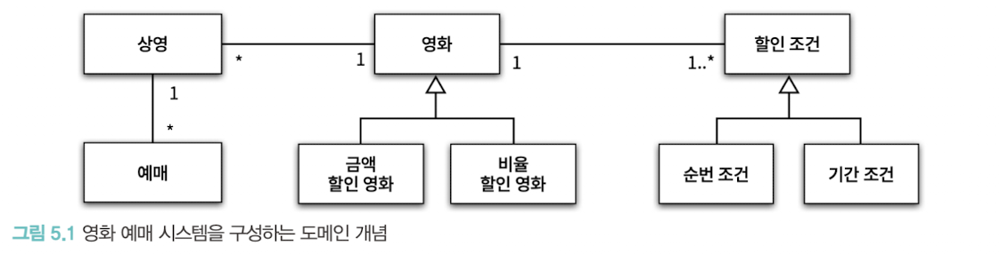
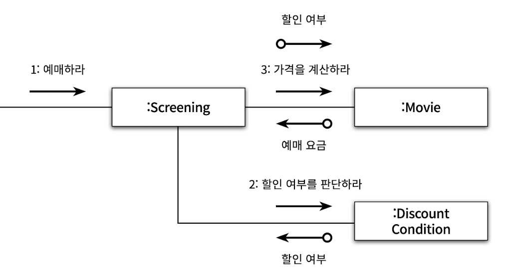
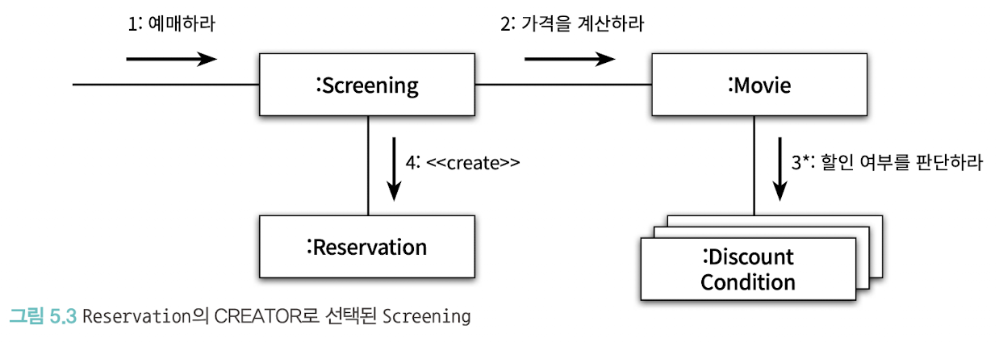
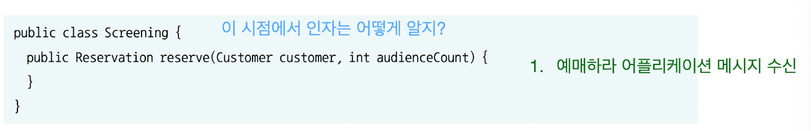
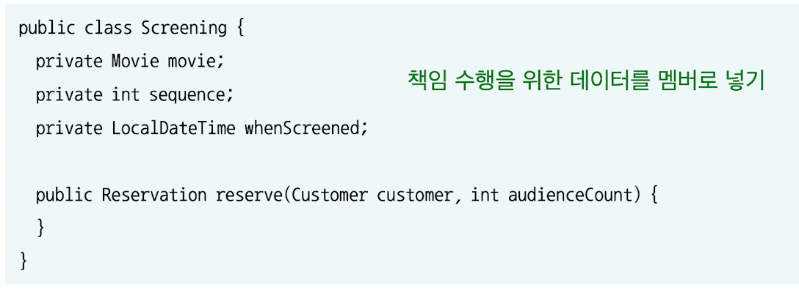
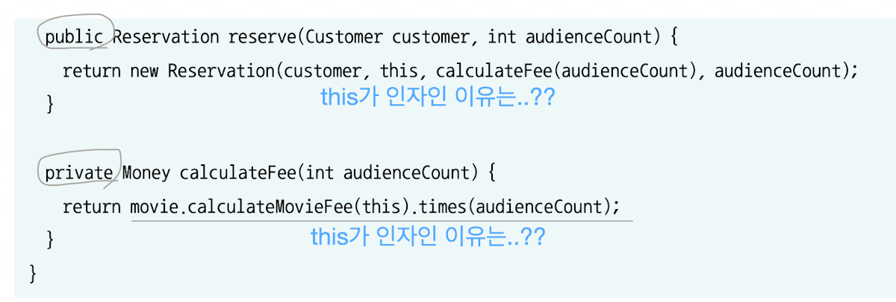
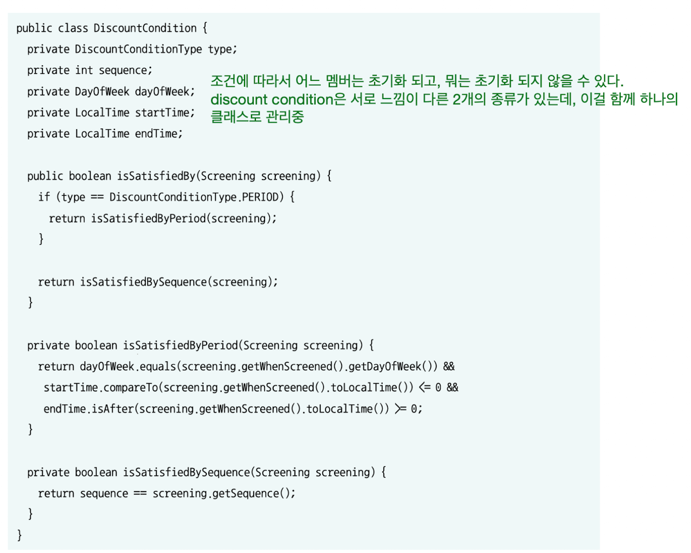
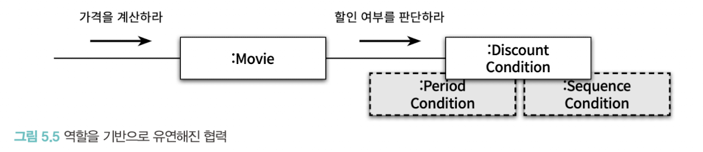
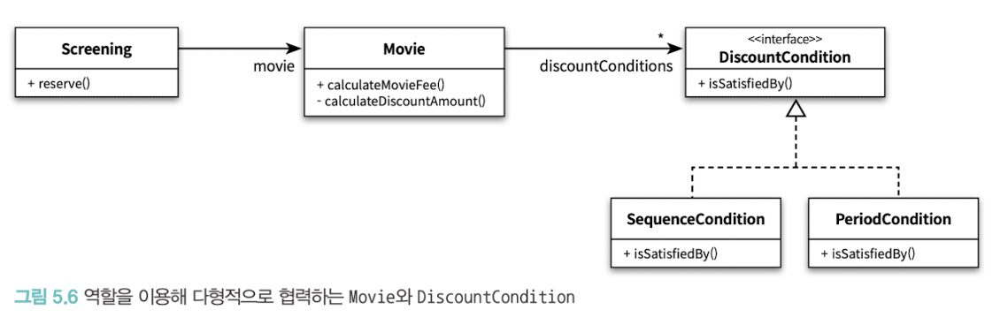
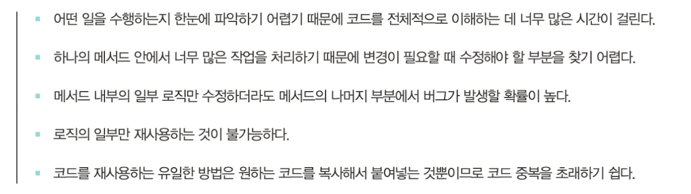

# 책임 할당하기

객체에게 중요한 것은 데이터가 아니라 외부에 제공하는 행동이다.

데이터는 객체가 책임을 수행하는 데 필요한 재료를 제공할 뿐.

객체지향 설계에서 가장 중요한 것은 적절한 객체에게 적절한 책임을 할당하는 능력이다. 어떻게 할당하는게 맞을까?

### 협력이라는 문맥 안에서 책임을 결정하라

객체에게 할당한 책임의 품질은 협력에 적합한 정도로 결정된다.

객체에게 할당된 책임이 협력에 어울리지 않는다면 그 책임은 나쁜 것이다.

책임은 객체의 입장이 아니라 객체가 참여하는 협력에 적합해야한다.

협력에 적합한 책임을 수확하기 위해서 메시지를 결정한 후에 객체를 선택해야 한다.

메시지가 클라이언트의 의도를 표현한다. 객체를 결정하기 전에 객체가 수신할 메시지를 먼저 결정해야한다.

## 책임 할당을 위한 GRASP 패턴

객체에게 책임을 할당할 때 지침으로 삼을 수 있는 원칙들의 집합을 패턴 형식으로 정리한 것.

### 도메인 개념에서 출발하기

설계를 시작하기 전에 도메인에 대한 개략적인 모습을 그려보는 것이 유용하다.

코드에 도메인 모습을 투영하기 수월해진다.

어떤 책임을 할당해야할 때 가장 먼저 고민해야 하는 유력한 후보가 도메인 개념이다.

물론 올바른 도메인 모델이란 존재하지 않는다.

도메인 모델의 구조가 코드의 구조에 영향을 미친다. 유연성이나 재사용성 등과 같이 실제 코드를 구현하면서 얻게 되는 통찰이 역으로 도메인에 대한 개념을 바꾸기도 한다.

### 정보 전문가에게 책임을 할당하라

책임 주도 설계 방식의 첫 단계는 애플리케이션이 제공해야 하는 기능을 애플리케이션의 책임으로 생각하는 것이다. 이를 **INFORMATION EXPERT(정보 전문가)패턴**이라고 한다.

전문가들의 후보가 바로 도메인 모델에서 작성한 노드들이 된다. 그러므로 미리 도메인 모델 그려보는게 유용하다.

객체에게 책임을 할당할 때 가장 기본이 되는 책임 할당 원칙이다. 이것만 지켜도 자율성이 높은 객체들로 구축할 가능성이 높아진다.

### 높은 응집도와 낮은 결합도

예매하라는 메시지에 여러 세부적인 메시지가 파생되고 여러 협력 방식이 존재할 수 있다.

위의 사진처럼 Screening이 Movie와 DiscountCondition 둘과 협력하는 구조로 설계할 수도 있다.

(근데 이 사진만 봐도 너무 절차지향적임. 메시지를 여기저기 요구하고 다닌다 == 절차지향적이다.)

(인터페이스는 매우 앏아야 한다!!)

위의 설계는 좋지 않다.

#### LOW COUPLING

도메인 상으로 Movie는 DiscountCondition의 목록을 속성으로 포함하고 있다.

Movie와 DiscountCondition은 이미 결합돼 있기 때문에 설계 전체적으로 결합도를 추가하지 않고도 협력을 완성할 수 있다. (도메인 모델 확인하기!)

Screening이 DicsountCondition과 협력할 경우에는 Screening과 DiscountCondition사이에 새로운 결합도가 추가된다.

LOW COUPLING 패턴의 관점에는 위 사진처럼 Screening과 DiscountCondition의 협력이 좋지 않다.(새로운 결합도가 생긴다.)

#### HIGH COHESION

Screening의 가장 중요한 책임은 예매를 생성하는 것이다.

Screening이 DiscountCondition과 협력해야한다면 Screening은 영화 요금 계산과 관련된 책임 일부를 떠안아야 한다. (?) 이 경우 Screening은 DiscountCondition이 할인 여부를 판단할 수 있고 Movie가 이 할인 여부를 필요로 한다는 사실 역시 알고 있어야 한다.

즉 예매 요금을 계산하는 방식이 변경될 경우 Screening도 함께 변경되게 된다.

Screening은 서로 다른 이유로 변경되는 책임을 짊어지게 되므로 응집도가 낮아질 수밖에 없다. (Screening이 바뀌어야 하는 이유는 상영과 관련된 것이어야 하는데 그게 아닌 다른 이유로 변경될 수 있다)

!! 같이 바뀐다 == 응집도가 있다.!!!

반대로 Movie의 주된 책임은 영화 요금을 계산하는 것이고 할인 조건이 바뀌어 Movie가 바뀌는 것은 크게 이상이 없어보인다.

### 창조자에게 객체 생성 책임을 할당하라

결론적으로 인스턴스를 생성해야하는 메시지의 경우 협력에 참여하는 누군가는 인스턴스를 생성해야한다.

CREATOR(창조자)패턴은 객체를 생성할 책임을 어떤 객체에게 할당할지에 대한 지침을 제공한다.

A객체를 생성해야할 때 아래 조건을 최대한 많이 만족하는 B에게 할당하면 된다.

- B가 A객체를 포함하거나 참조한다.
- B가 A 객체를 기록한다.
- B가 A 객체를 긴밀하게 사용한다.
- B가 A 객체를 초기화하는 데 필요한 데이터를 가지고 있다.(이 경우는 A에 대한 정보 전문가다)

Reservation을 잘 알고 있거나, 긴밀하게 사용하거나, 초기화에 필요한 데이터를 가지고 있는 객체는 Screening이다.

예매 정보를 생성하는 데 필요한 영화, 상영 시간, 상영 순번 등의 정보에 대한 전문가이면서 예매 요금을 계산하는 데 필수적인 Movie도 알고 있다.

## 구현해보기

Screening은 영화를 예매할 책임을 맡으며 그 결과로 Reservation인스턴스를 생성할 책임을 수행해야한다. 즉 Screening은 <u>에매에 대한 정보 전문가</u>인 동시에 <u>Reservation의 창조자</u>이다.

Screengin은 "예매하라"메시지에 응답할 수 있어야 한다. 이 메시지를 처리할 수 있는 메서드 구현하자 (메시지에 대응하는 1개의 public메서드가 있어야 한다.)

이후 이 책임을 수행하기 위해서 필요한 데이터를 멤버로 가지게 한다.

- movie는 영화 가격 계산 결과 필요해서.

이후 필요에 맞추어서 그 데이터를 사용하게 하면 된다.

사용하는 것은 하나의 메시지(메서드)여야한다.

이런식으로 쭉 책임 주도 개발 하면 된다.

\[합성과 상속\]

할인 계산 방식은 두 개다.

아래와 같이 하나의 클래스로 만들면 일부만 초기화 되는 문제가 발생할 수 있다.

(이전에 이야기 했던대로 합성을 사용하면 되긴 한다. 겹치는 이야기)

위의 DiscountCondition은 하나 이상의 변경 이유를 가지기 땜누에 응집도가 낮다. 응집도가 낮다는 것은 서로 연관성이 없는 기능이나 데이터가 하나의 클래스 안에 뭉쳐져 있다는 것을 의미한다. **⇒ 변경의 이유에 따라 클래스를 분리해야 한다.**

위에서 isSatisfiedBySequence메서드와 isSatisfiedByPeriod 메서드는 서로 다른 이유로 변경된다. (금액 할인 정책/비율 할인 정책)

#### \[코드를 통해 변경의 이유를 파악할 수 있는 방법\]

1. 인스턴스 변수가 초기화되는 시점을 살펴보는 것
   1. 응집도가 높은 클래스는 인스턴스를 생성할 때 모든 속성을 함께 초기화된다.
   2. 응집도가 낮은 클래스는 객체의 속성 중 일부만 초기화하고 일부는 초기화되지 않는 상태로 남겨진다.
   3. 즉 코드 개선시 **함께 초기화되는 것을 기준으로 코드를 분리해야한다.**
2. 메서드들이 인스턴스 변수를 사용하는 방식을 살펴보는 것
   1. 모든 메서드가 객체의 모든 속성을 사용한다면 클래스의 응집도는 높다고 볼 수 있다.
   2. 메서드들이 사용하는 속성에 따라 그룹이 나뉜다면 클래스의 응집도가 낮다고 볼 수 있다.
   3. (특정 메서드들이 특정 멤버만 사용하고, 다른 메서드들은 다른 멤버들만 사용한다면 의심)
   4. 코드 개선시 속성 그룹과 해당 그룹에 접근하는 메서드 그룹을 기준으로 코드를 분리해야한다.

#### 클래스 응집도 파악하기

- 클래스가 하나 이상의 이유로 변경돼야 한다면 응집도가 낮은 것이다. 변경의 이유를 기준으로 클래스를 분리하라
- 클래스의 인스턴스를 초기화하는 시점에 경우에 따라 서로 다른 속성을 초기화하고 있다면 응집도가 낮은 것이다. 초기화되는 속성의 그룹을 기누으로 클래스를 분리하라
- 메서드 그룹이 속성 그룹을 사용하는지 여부로 나뉜다면 응집도가 낮은 것이다. 이들 그룹을 기준으로 클래스를 분리하라

하지만 단순히 분리만 하게 되면 이렇게 분리된 모든 객체들(PeriodCondition, SquenceCondition) 이 둘 다 알아야 하고, 그만큼 응집도가 떨어질 수 있다.

이를 다형성(인터페이스)을 통해서 해결 가능하다.

### 다형성을 통해 분리라기

추상 클래스나 인터페이스를 사용해서 만들고 사용하는 곳에서는 구현이 아닌 여기에 의존하게 한다.

이런식으로 객체의 타입에 따라 변하는 행동이 있다면 타입을 분리하고 변화하는 행동을 각 타입의 책입으로 할당하라는 것이다. 이를 **POLYMORPHISM(다형성)패턴**이라고 한다.

### 변경과 유연성

개발자로서 변경에 대비할 수 있는 두 가지 방법.

하나는 코드를 이해하고 수정하기 쉽도록 최대한 단순하게 설계하는것

하나는 코드를 수정하지 않고도 변경을 수용할 수 있도록 코드를 더 유연하게 만드는 것이다.

유사한 변경이 반복적으로 발생하고 있다면 복잡성이 상승하더라도 유연성을 추가하는 후자 방법이 더 좋다.

## 책임 주도 설계의 대안

일단 실행되는 코드를 얻고 난 후에 코드 상에 명확하게 드러나는 챋임들을 올바른 위치로 이동시키는 것

> 🤔 AI 시대에 가장 좋은 방식 아닐까?
>
> ai는 그럴싸한 결과물을 매우 빠르게 내놓음. 이걸 이용하면 딱 돌아가는 코드 정도만 얻을 수 있으면 됨.  
> "돌아간다"의 기준 == 테스트  
> 리팩터링은 여전히 개발자의 몫이지 않을까?  
> 소프트웨어 == 자주 변경되는 것. 한번 구매하면 절대 바뀌지 않는 하드웨어와 다름.  
> 소프트웨어에도 수명이 있다. 오래되면 → 유지보수성이 정말 중요하다.
>
> 일단 ai를 통해서 빠르게 돌아가는 코드를 만들고, 이후에 사람이 개입을 해서 좋은 코드로 만들어야 하지 않을까?

일단 돌아가는 코들르 만들면 메서드 하나하나가 매우 뚱뚱해진다. 긴 메서드는 아래의 이유로 코드의 유지 보수에 부정적인 영향을 미친다.

즉 긴 메서드는 응집도가 낮기 땜누에 이해하기도 어렵고 재사용하기도 어려우며 변경하기도 어렵다.

이를 **몬스터 메서드**라고 부른다.

메서드가 명령문들의 그룹으로 구성되고 각 그룸에 주석을 달아야 할 필요가 있다면 그 메서드의 응집도는 낮다.

주석을 추가하는 대신 메서드를 작게 분리해서 각 메서드의 응집도를 높여라.

클레스의 응집도와 메서드의 응집도는 다르다.

응집도가 높은 메서드는 변경되는 이유가 단 하나여야 한다. 클래스가 작고 목적이 명확한 메서드들로 구성돼 있다면 변경을 처리하기 위해 어떤 메서드를 수정해야 하는지 쉽게 판단할 수 있다.

메서드의 크기가 작고 목적이 분명하기 때문에 재사용도 쉽다.

작은 메서드들로 조합된 메서드는 마치 주석들을 나열한 것처럼 보이기 때문에 코드를 이해하기도 쉽다.
