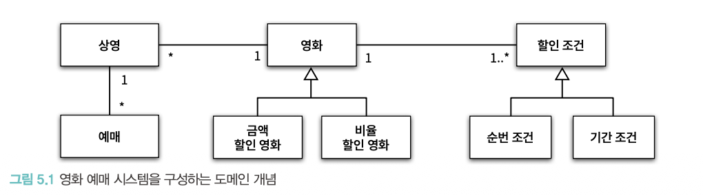
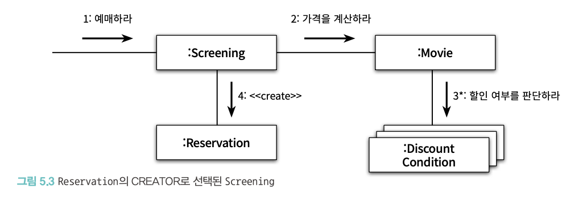
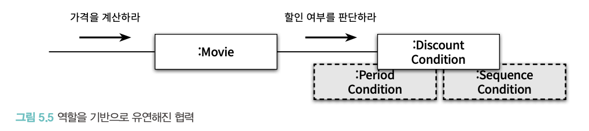

GRASP 패턴

- 응집도와 결합도, 캡슐화 같은 다양한 기준에 따라 책임을 할당하고 결과를 트레이드오프할 수 있는 기준을 배우게 될 것이다.

## 01 책임 주도 설계를 향해

- 데이터보다 행동을 먼저 결정하라
- 협력이라는 문맥 안에서 책임을 결정하라

## 02 책임 할당을 위한 GRASP 패턴

- General 일반적인
- Resposeibility 책임
- Assignment 할당을 위한
- Software 소프트웨어
- Pattern 패턴

→ 객체에게 책임을 할당할 때 지침으로 삼을 수 있는 원칙들의 집합을 패턴 형식으로 정리한 것

### 도메인 개념에서 출발하기

설계를 시작하기 전에 도메인에 대한 개략적인 모습을 그려보기

아래처럼 정확하거나 완벽할 필요는 없다. 설계를 시작하는 출발점이 되면 된다. 도메인 개념을 완벽하게 정리하려는 목적은 아니다. 도메인 개념을 정리하는 데 너무 많은 시간을 들이지 말고 빠르게 설계와 구현을 진행하라



### 정보 전문가에게 책임을 할당하기

정보 전문가에서 이야기하는 정보와 데이터는 다르다.

객체가 정보를 알고 있다고 해서 그 정보를 저장하고 있을 필요는 없다.

해당 정보를 제공하는 다른 객체를 알거나, 필요한 정보를 게산해서 제공할 수도 있다.

<aside>

적절한 책임 전문가를 찾아라 → 지금처럼 할인 여부를 판단하는 책임이 영화에 있으면 안 된다는 생각을 할 수 있을까? 할인 조건이라는 별도 객체가 필요하다는? 사실 그게 가장 어려울 것 같다.

</aside>

### 낮은 결합도와 높은 응집도

- 낮은 결합도

  DiscountCondition이 Screening과 협력하기 vs Movie와 협력하기

  더 결합도가 낮은 방안을 선택해라

  결합도가 낮은 걸 판단하는 한 가지 기준은 도메인 개념을 확인하는 것

  도메인 상으로 영화와 할인이 결합되어 있으므로 추가 결합을 만들지 않는 Movie쪽이 합리적이다

  

- 높은 응집도

  Screening의 가장 중요한 책임은 예매를 생성하는 것

  DiscountCondition과 협력하게 되면 영화 요금 계산과 관련된 책임을 떠안고, 예매 요금을 계산하는 방식이 변경되는 경우에 함께 변경된다

  Movie의 주된 책임이 영화 요금을 계산하는 것이므로 이쪽이 DisocuntCondition과 협력하는 게 합리적이다.

### 창조자에게 객체 생성 책임을 할당하기

다음을 최대한 많이 만족하는 B에게 객체 생성 책임을 할당하라

- B가 A 객체를 포함하거나 참조한다.
- B가 A 객체를 기록한다.
- B가 A 객체를 긴밀하게 사용한다.
- B가 A 객체를 초기화하는 데 필요한 데이터를 가지고 있다
  (이 경우 B는 A에 대한 정보 전문가다)

이 예제에서는, 예매 정보(Reservation)을 생성하는 데 필요한 영화, 상영 시간, 상영 순번 등의 정보에 대한 전문가인 Screening을 CREATOR(창조자)로 선택하는 게 적절하다.



## 03 구현을 통한 검증

```java
public class Screening {
	private Movie movie;
	private int sequence;
	private LocalDateTime whenScreened;
	
	public Reservation reserve(Customer customer, int audienceCount) {
		return new Reservation(customer, this, calculateFee(audienceCount), audienceCount);
	}
	
	private Money calculateFee(int audienceCount) {
		return movie.calculateMovieFee(this).times(audienceCount);
	}
}
```

```java
public class Movie {
	private String title;
	private Duration runningTime;
	private Money fee;
	private List<DiscountCondition> discountConditions;
	
	private MovieType movieType; // AMOUNT_DISCOUNT, PERCENT_DISCOUNT, NONE_DISCOUNT
	private Money discountAmount;
	private double discountPercent;
	
	public Money calculateMovieFee(Screening screening) {
		if (isDiscountable(screening)) {
			return fee.minus(calculateDiscountAmount());
		}
		
		return fee;
	}
	
	private boolean isDiscountable(Screening screening) {
		return discountConditions.stream()
			.anyMatch(condition -> condition.isSatisfiedBy(screening));
		}
	}
	
	private Money calculateDiscountAmount() {
		switch(movieType) {
			case AMOUNT_DISCOUNT:
				return calculateAmountDiscountAmount();
			case PERCENT_DISCOUNT:
				return calculatePercentDiscountAmount();
			case NONE_DISCOUNT:
				return calculateNoneDiscountAmount();
		}
		
		throw new IllegalStateException();
	}
	
	private Money calculateAmountDiscountAmount() {
		return discountAmount;
	}
	
	private Money calculatePercentDiscountAmount() {
		return fee.times(discountPercent);
	}
	
	private Money calculateNoneDiscountAmount() {
		return Money.ZERO;
	}
}
```

```java
public class DiscountCondition {
	private DiscountConditionType type;
	private int sequence;
	private DayOfWeek dayOfWeek;
	private LocalTime startTime;
	private LocalTime endTime;
	
	public boolean isSatisfiedBy(Screening screening) {
		if (type == DiscountConditionType.PERIOD) {
			return isSatisfiedByPeriod(screening);
		}
		return isSatisfiedBySequence(screening);
	}
	
	private boolean isSatisfiedByPeriod(Screening screening) {
		return dayOfWeek.equals(screening.getWhenScreened().getDayOfWeek()) &&
			startTime.compareTo(screening.getWhenScreened().toLocalTime()) <= 0 &&
			endTime.isAfter(screening.getWhenScreened().toLocalTime()) >= 0;
	}
	
	private boolean isSatisfiedBySequence(Screening screening) {
		return sequence == screening.getSequence();
	}
}
```

```java
public enum DiscountConditionType {
	SEQUENCE, // 순번 조건
	PERIOD // 기간 조건
}
```

### DiscountCondition 개선하기

<aside>

전체 코드에서 내가 찾아본 것들…

- MovieType에 따른 Movie의 discountAmount 계산 로직

  movieType에 따라 case와 메서드가 추가됨

- Screening → Movie → DisocuntCondition → Screening 의존성 괜찮은가?
- DiscountConditionType에 따른 DiscountCondition의 isSatisfiedBy 계산 로직

  DiscountConditionType에 따라 if문과 메서드 늘어남

</aside>

DiscountCondition은 서로 다른 세 가지 변경 이유를 가진다.

- 새로운 할인 조건 추가

  isSatisfiedBy 메서드 안의 if-else 구문 수정, DiscountCondition 속성 추가 등

- 순번 조건을 판단하는 로직 변경

  isSatisfiedBySequence 메서드 내부 구현 수정, DiscountCondition의 sequence 속성 변경 등

- 기간 조건을 판단하는 로직 변경

  isSatisfiedByPeriod 메서드 내부 구현 수정, DiscountCondition의 dayOfWeek, startTime, endTime 속성 변경 등

하나 이상의 변경 이유 → 응집도가 낮다 → 변경의 이유에 따라 클래스를 분리해야 한다

<aside>

#### 낮은 응집도의 3가지 징후

- 클래스가 하나 이상의 이유로 변경된다.

  → 변경의 이유를 기준으로 클래스를 분리해야 한다.

- **인스턴스 변수가 초기화되는 시점이 서로 다르다**
  응집도가 높은 클래스는 인스턴스를 생성할 때 모든 속성을 함께 초기화한다.

  → 함께 초기화되는 속성을 기준으로 코드를 분리해야 한다.

- 메서드들이 사용하는 속성에 따라 그룹이 나뉜다
  응집도가 높은 클래스는 모든 메서드가 객체의 모든 속성을 사용한다.

  → 속성 그룹과 해당 그룹에 접근하는 메서드 그룹을 기준으로 코드를 분리해야 한다.

</aside>

순번 조건과 기간 조건을 하나의 DiscountCondition에서 각각 SequenceCondition과 PeriodCondition으로 분리하면 응집도 높은 코드를 만들 수 있다.

하지만 Movie 입장에서 두 가지 서로 다른 클래스에 결합되며 전체적인 결합도가 올라간다.

또, 할인 조건이 추가되는 경우 DiscountCondition 내부에서만 분기를 추가하면 됐던 것에 반해 새로 추가되는 클래스에 따라 Movie도 함께 수정해야 한다.

### 다형성을 통해 분리하기

```java
public interface DiscountCondition {
	boolean isSatisfiedBy(Screening screening);
}
```

```java
public class PeriodCondition implements DiscountCondition { ... }

public class SequenceCondition implements DiscountCondition { ... }
```


